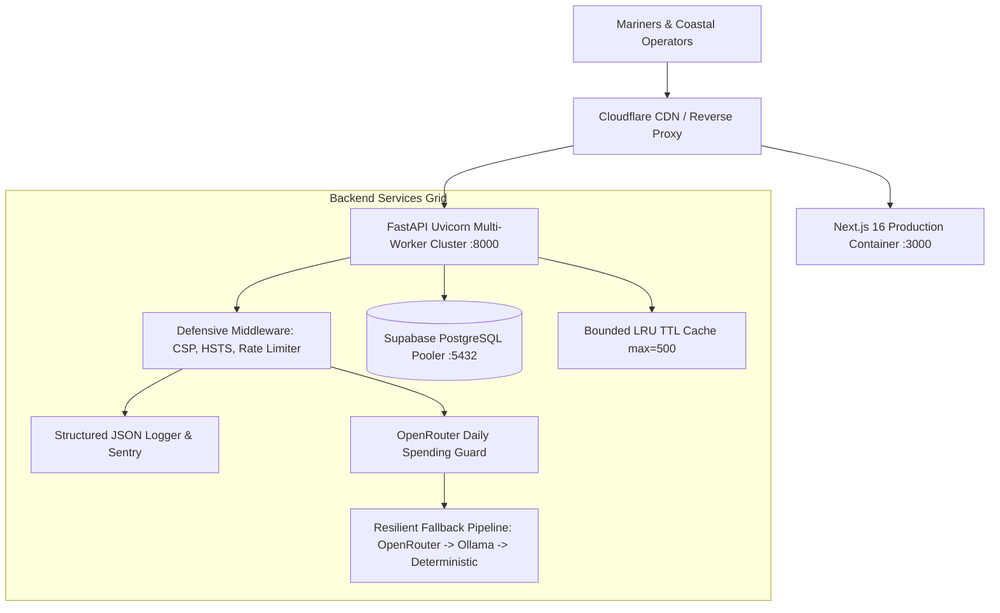

# ORCA Marine AI & Coastal Safety Grid — Production Deployment Guide

This document establishes the official production deployment, operations, and disaster recovery procedures for **ORCA (Oceanic Reconnaissance & Coastal Advisory Grid)**.

---

## 1. System Architecture & Topology



---

## 2. Environment Variables Matrix

### 2.1 Backend Environment Variables (`services/api/.env`)

| Variable | Type | Required | Default | Security Classification | Description |
| :--- | :---: | :---: | :---: | :---: | :--- |
| `ENVIRONMENT` | `string` | **Yes** | `production` | Public | Deployment tier (`production`, `staging`, `development`). |
| `WEB_CONCURRENCY` | `int` | No | `4` | Public | Number of parallel Uvicorn worker processes. |
| `FRONTEND_URL` | `url` | **Yes** | `http://localhost:3000` | Public | Strict CORS allowed origin in production. |
| `DATABASE_URL` | `string` | **Yes** | — | **CRITICAL SECRET** | Supabase connection URI (IPv4 Supavisor pooler on port 5432). |
| `SUPABASE_URL` | `url` | **Yes** | — | Internal | Supabase project endpoint. |
| `SUPABASE_ANON_KEY` | `string` | **Yes** | — | Public/Client | Supabase anonymous public API key. |
| `SUPABASE_SERVICE_ROLE_KEY` | `string` | **Yes** | — | **HIGH SECRET** | Authoritative Supabase key. **NEVER expose to frontend**. |
| `SUPABASE_JWT_SECRET` | `string` | **Yes** | — | **HIGH SECRET** | JWT secret (min 32 chars) for cryptographic token validation. |
| `ADMIN_EMAIL` | `email` | **Yes** | — | Secret | Authoritative Super Admin authentication email. |
| `ADMIN_PASSWORD` | `string` | **Yes** | — | **HIGH SECRET** | Cryptographic Super Admin password. |
| `OPENROUTER_API_KEY` | `string` | No | `""` | Secret | Cloud LLM inference key (Tier 1). |
| `OPENROUTER_DAILY_LIMIT_PER_USER` | `int` | No | `50` | Operational | Daily request ceiling per user before cascading to Ollama. |
| `LOG_FORMAT` | `string` | No | `json` | Operational | Logging format: `json` (production) or `text` (dev). |
| `SENTRY_DSN` | `url` | No | `""` | Secret | Sentry error tracking ingestion DSN. |

### 2.2 Frontend Environment Variables (`.env.local`)

| Variable | Type | Required | Security Classification | Description |
| :--- | :---: | :---: | :---: | :--- |
| `NEXT_PUBLIC_API_URL` | `url` | **Yes** | Public | Publicly accessible URL of the FastAPI backend. |
| `NEXT_PUBLIC_SUPABASE_URL` | `url` | **Yes** | Public | Publicly accessible Supabase URL. |
| `NEXT_PUBLIC_SUPABASE_ANON_KEY` | `string` | **Yes** | Public | Public Supabase anon key (strictly client-safe). |

> [!CAUTION]
> The `SUPABASE_SERVICE_ROLE_KEY` must **NEVER** be prefixed with `NEXT_PUBLIC_` or bundled into client code. It must reside strictly in the backend `.env`.

---

## 3. Deployment Methods

### Option A: Docker Compose (Recommended)

1. **Clone and Configure Environment:**
   ```bash
   git clone https://github.com/sandeshpagar/ORCA.git /opt/orca
   cd /opt/orca
   cp .env.example .env
   cp services/api/.env.example services/api/.env
   # Edit values in .env and services/api/.env with production credentials
   ```

2. **Launch Stack:**
   ```bash
   docker-compose up --build -d
   ```

3. **Verify Container Health:**
   ```bash
   docker-compose ps
   docker-compose logs -f --tail=50
   ```

### Option B: Bare-Metal / Systemd Deployment

#### 1. Backend Service (`/etc/systemd/system/orca-api.service`):
```ini
[Unit]
Description=ORCA FastAPI Backend Cluster
After=network.target

[Service]
User=orca
Group=orca
WorkingDirectory=/opt/orca/services/api
EnvironmentFile=/opt/orca/services/api/.env
ExecStart=/opt/orca/services/api/.venv/bin/uvicorn app.main:app --host 0.0.0.0 --port 8000 --workers 4
Restart=always
RestartSec=5s

[Install]
WantedBy=multi-user.target
```

#### 2. Frontend Service (`/etc/systemd/system/orca-frontend.service`):
```ini
[Unit]
Description=ORCA Next.js 16 Frontend
After=network.target orca-api.service

[Service]
User=orca
Group=orca
WorkingDirectory=/opt/orca
Environment=NODE_ENV=production
Environment=PORT=3000
EnvironmentFile=/opt/orca/.env.local
ExecStart=/usr/bin/npm run start
Restart=always
RestartSec=5s

[Install]
WantedBy=multi-user.target
```

---

## 4. Healthcheck & Observability Endpoints

| Endpoint | Method | Expected Status | Purpose | Failure Action |
| :--- | :---: | :---: | :--- | :--- |
| `/health` | `GET` | `200 OK` | **Liveness Probe**: Confirms API process is alive. No external calls. | Restart container. |
| `/ready` | `GET` | `200 OK` | **Readiness Probe**: Verifies database connectivity and query health. | Pull from load balancer rotation. |
| `/api/admin/telemetry` | `GET` | `200 OK` (Admin Auth) | **Component Observability**: Reports status of all agents and data adapters. | Alert operations on-call. |

---

## 5. Zero-Downtime Deployment & Rolling Update

1. **Pre-Flight Validation:**
   ```bash
   npm run lint
   npm run build
   pytest services/api/tests -q
   ```
2. **Blue/Green or Rolling Container Update:**
   ```bash
   docker-compose pull
   docker-compose up -d --no-deps --build api
   # Wait for /health to return 200 OK
   docker-compose up -d --no-deps --build frontend
   ```

---

## 6. Rollback Procedure

If an anomaly occurs post-deployment:
1. Revert to previous stable Git commit or Docker tag:
   ```bash
   git checkout <PREVIOUS_STABLE_TAG>
   docker-compose up -d --build
   ```
2. Verify system health:
   ```bash
   curl -f http://localhost:8000/health
   curl -f http://localhost:8000/ready
   ```
3. Check structured incident logs:
   ```bash
   docker-compose logs api | grep "Incident"
   ```

---

## 7. Security & Compliance Checklist (PRD §8)

- [x] **Secret Isolation**: `SUPABASE_SERVICE_ROLE_KEY` present only on server, never on client.
- [x] **Row-Level Security (RLS)**: Enabled across all database tables.
- [x] **Rate Limiting**: Sliding-window rate limiter active on chat (`/chat`, `/api/chat`).
- [x] **Defensive HTTP Headers**: Content-Security-Policy, HSTS, X-Content-Type-Options, X-Frame-Options DENY.
- [x] **Data Honesty Policy (PRD §8)**: Zero fabricated marine measurements. Honest disclaimers on all cached or synthetic telemetry.
- [x] **Multilingual Support**: All 6 coastal corridor scripts (Devanagari, Gujarati, Odia, Tamil, Telugu, English) supported with dedicated font fallbacks.
- [x] **VHF Channel 16 Priority**: Prominent UI notice prioritizing official INCOIS, IMD, and Coast Guard broadcasts.
