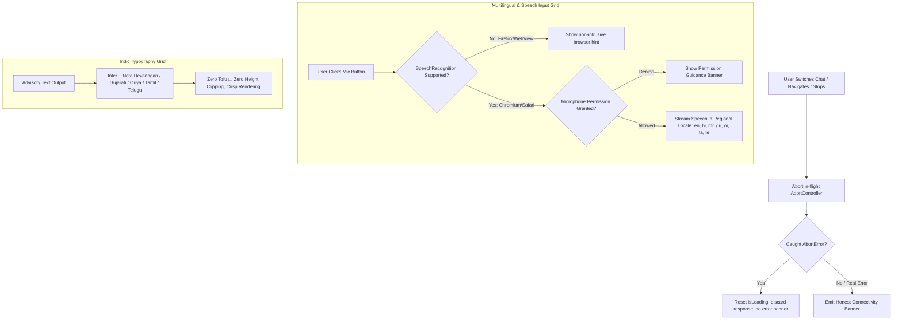

# Phase 6: Frontend Quality & Multilingual Resilience Implementation Plan

> **For agentic workers:** REQUIRED SUB-SKILL: Use superpowers:subagent-driven-development to implement this plan task-by-task. Steps use checkbox (`- [ ]`) syntax for tracking.

**Goal:** Deliver production-grade frontend resilience and quality for ORCA: fix broken Next.js 16 build/lint scripts, provide rock-solid request and stream cancellation (AbortController) on route switch/unmount without ghost error pollution, support all 6 coastal corridor Indic scripts (Devanagari, Gujarati, Odia, Tamil, Telugu) with zero font clipping or tofu glyphs, provide resilient Web Speech API fallback for unsupported browsers/permission denials, and verify 360px mobile responsiveness and ARIA a11y standards.

**Architecture:**
1. **Next.js 16 Build & Lint Tooling (`package.json`)**:
   - Next.js 16 CLI no longer bundles `next lint` (fails with `Invalid project directory provided: D:\ORCA\lint`).
   - Replace with `"lint": "next typegen && tsc --noEmit"` to ensure end-to-end static type safety and Turbopack route type generation.
   - Verify `npm run build` passes with 0 errors across all 10 App Router routes (`/`, `/_not-found`, `/admin`, `/alerts`, `/chat`, `/guide`, `/login`, `/monitor`, `/profile`, `/signup`).
2. **Request & Stream Cancellation (`contexts/ChatContext.tsx`)**:
   - Introduce `activeAbortControllerRef` in `ChatContext`.
   - On conversation switch (`handleSelectConversation`), starting a new chat (`handleNewChat`), or unmounting: abort in-flight fetch immediately.
   - Silence `AbortError` cleanly: do not append confusing "Could not connect to FastAPI backend" banners to the persistent conversation history when a request was deliberately aborted.
   - Retain 401 automatic recovery and zero-fabrication honest fallback for genuine network errors.
3. **Web Speech API & Regional Indic Alignment (`hooks/useSpeechRecognition.ts` & `contexts/ChatContext.tsx`)**:
   - Integrate Telugu (`te` -> `te-IN`, "తెలుగు") into `LANGUAGES` and `SPEECH_LANG_MAP` alongside `en-IN`, `hi-IN`, `mr-IN`, `gu-IN`, `or-IN`, `ta-IN`.
   - Update `services/api/app/llm/fallback_client.py` to include `te` in `is_indic`.
   - Enhance unsupported browser detection: provide non-blocking banner when Web Speech API is missing (e.g. Firefox/Edge mobile/in-app webviews).
   - Graceful microphone permission handling (`not-allowed`, `no-speech`, `aborted`, `language-not-supported`).
4. **Typography & Script Fallbacks (`app/layout.tsx` & `tailwind.config.ts`)**:
   - Embed Google Fonts for Indic scripts: `Noto Sans Devanagari`, `Noto Sans Gujarati`, `Noto Sans Oriya`, `Noto Sans Tamil`, `Noto Sans Telugu`.
   - Configure Tailwind typography stacks with explicit Indic font fallbacks to guarantee crisp glyph rendering on all client platforms.
5. **Responsive Layouts & Accessibility (`app/(app)/chat/page.tsx` & `components/chat/ConversationDrawer.tsx`)**:
   - Verify mobile viewport (360px) layout: ensure drawer overlay, toolbar wrapping, and input field responsiveness.
   - Equip all interactive controls with clear `aria-label` attributes.
   - Add `aria-live="polite"` to message stream and `role="status"` to listening indicators.

**Architecture Diagram:**

**Tech Stack:** Next.js 16.3.4 (Turbopack, App Router), React 18.3.1, TypeScript 5.5.4, Tailwind CSS 3.4.17, Web Speech API, Google Fonts (Noto Sans Indic).

**Spec:** `docs/superpowers/plans/2026-09-29-phase6-frontend-quality.md`

## Global Constraints
- Python virtual environment: `services/api/.venv/Scripts/python.exe`
- Pytest test runner: `services/api/.venv/Scripts/pytest.exe services/api/tests`
- Frontend build: `npm run build`
- Frontend lint: `npm run lint`
- Frontend typecheck: `npx tsc --noEmit`
- Preserve all 115 backend tests without failure.

---

### Task 6.1: Build & Lint Script Repair (`package.json`)

**Files:**
- Modify: `package.json`
- Verify: `npm run lint`, `npm run build`

**Step-by-step:**
1. Update `package.json` scripts:
   - Change `"lint": "next lint"` to `"lint": "next typegen && tsc --noEmit"`.
2. Run `npm run lint` and verify clean exit code 0.
3. Run `npm run build` and verify Turbopack and static export succeed with code 0.

---

### Task 6.2: SSE / Stream & Request Cancellation (`contexts/ChatContext.tsx`)

**Files:**
- Modify: `contexts/ChatContext.tsx`

**Step-by-step:**
1. Add `activeAbortControllerRef = useRef<AbortController | null>(null)` inside `ChatProvider`.
2. In `handleSendMessage`:
   - If `activeAbortControllerRef.current` exists, abort it before starting a new request.
   - Create new `AbortController()`, assign to ref, and pass `signal: controller.signal` to `fetch(`${API_BASE_URL}/chat`)`.
   - On success or finally, clear the ref if it matches the current controller.
3. In `handleSelectConversation` and `handleNewChat`:
   - If `activeAbortControllerRef.current` is active, call `.abort()` and set `isLoading(false)`.
4. In unmount cleanup:
   - Abort any in-flight controller on component unmount.
5. In `catch (err: any)` in `handleSendMessage`:
   - If `err.name === "AbortError"` or `err.message?.includes("aborted")`:
     - Simply return without creating an `err-${Date.now()}` message and without logging error warnings.
     - Reset `isLoading(false)`.

---

### Task 6.3: Web Speech API & Multilingual Locale Hardening (`hooks/useSpeechRecognition.ts`, `contexts/ChatContext.tsx`, `services/api/app/llm/fallback_client.py`)

**Files:**
- Modify: `contexts/ChatContext.tsx`
- Modify: `hooks/useSpeechRecognition.ts`
- Modify: `services/api/app/llm/fallback_client.py`

**Step-by-step:**
1. In `contexts/ChatContext.tsx`:
   - Add Telugu to `LANGUAGES`: `{ code: "te", label: "తెలుగు", name: "Telugu" }`.
   - Add `te: "te-IN"` to `SPEECH_LANG_MAP`.
2. In `services/api/app/llm/fallback_client.py`:
   - Ensure `is_indic` includes `"te"`: `["hi", "mr", "gu", "or", "ta", "te"]`.
3. In `hooks/useSpeechRecognition.ts`:
   - Ensure `isSupported` accurately reflects browser availability and doesn't throw on SSR.
   - Handle permission denied, network errors, and language-not-supported gracefully with clear user guidance.
   - Ensure cleanup detaches listeners prior to calling `.abort()` to prevent React state leaks.

---

### Task 6.4: Typography & Multilingual Font Fallbacks (`app/layout.tsx`, `tailwind.config.ts`)

**Files:**
- Modify: `app/layout.tsx`
- Modify: `tailwind.config.ts`

**Step-by-step:**
1. In `app/layout.tsx`:
   - Add Google Fonts `<link>` for `Noto+Sans+Devanagari`, `Noto+Sans+Gujarati`, `Noto+Sans+Oriya`, `Noto+Sans+Tamil`, and `Noto+Sans+Telugu`.
2. In `tailwind.config.ts`:
   - Update `fontFamily` definition for `body-md`, `body-lg`, `body-sm`, `headline-lg`, `headline-md`, `headline-sm`, and `display`:
   - Prepend `var(--font-inter), "Inter"` followed by `"Noto Sans Devanagari", "Noto Sans Gujarati", "Noto Sans Oriya", "Noto Sans Tamil", "Noto Sans Telugu", system-ui, -apple-system, sans-serif`.
3. Run `npm run build` to verify font CSS compilation.

---

### Task 6.5: Responsive Layouts & Accessibility (a11y) (`app/(app)/chat/page.tsx`, `components/chat/ConversationDrawer.tsx`)

**Files:**
- Modify: `app/(app)/chat/page.tsx`
- Modify: `components/chat/ConversationDrawer.tsx`

**Step-by-step:**
1. In `components/chat/ConversationDrawer.tsx`:
   - Ensure mobile backdrop has `aria-modal="true"`, `role="dialog"`, and `aria-label="Conversation history"`.
   - Ensure close button and new chat button have explicit `aria-label`.
2. In `app/(app)/chat/page.tsx`:
   - Add `aria-live="polite"` and `aria-atomic="false"` to chat message list container so newly received advisories are announced by screen readers.
   - Add `aria-label` to:
     - Drawer toggle button ("Toggle conversation drawer")
     - Model selector dropdown ("Select AI reasoning model")
     - Microphone button ("Start voice input" / "Stop voice input")
     - Send message button ("Send message")
     - Language selector ("Change language: current language [Language Name]")
   - Ensure active speech recording indicator has `role="status"` and `aria-live="assertive"`.
   - Test 360px mobile responsiveness: ensure input toolbar buttons flex-wrap properly on ultra-narrow viewports without cutting off the send or mic buttons.

---

### Task 6.6: End-to-End Verification & Quality Audit

**Files:**
- Verify: `npm run lint` -> clean exit code 0
- Verify: `npm run build` -> clean exit code 0
- Verify: `pytest services/api/tests` -> 115/115 pass
- Report comprehensive findings and status table to user.
