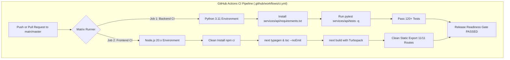

# Phase 7: Automated Tests, CI/CD Pipeline & Dependency Security Plan

> **For agentic workers:** REQUIRED SUB-SKILL: Use superpowers:subagent-driven-development to implement this plan task-by-task. Steps use checkbox (`- [ ]`) syntax for tracking.

**Goal:** Deliver a production-grade automated testing and CI/CD architecture for ORCA: verify and extend test coverage for Auth/RBAC, input validation, and AI fallback edge cases; audit Python and Node dependencies with zero unaddressed high/critical vulnerabilities; verify explicit pinning and real-world usage of all libraries; and establish a GitHub Actions workflow running automated backend pytest, frontend typegen, strict TypeScript checking, and Next.js Turbopack production builds on every push and pull request.

**Architecture:**
1. **Backend Test Suite Expansion (`services/api/tests/test_phase7_quality_suite.py`)**:
   - Auth/RBAC Edge Cases: Expired JWTs (`exp` in the past), signature tampering, non-admin role attempting administrative metric access.
   - Input Validation Bounds: Latitude bounds check (`lat > 90.0` or `lat < -90.0`), longitude bounds check (`lon > 180.0` or `lon < -180.0`), oversized prompt (`len > 1000`), invalid language regex rejection (`fr-FR`).
   - Multilingual Telugu & Strict Zero-Fabrication Invariant: Verify Telugu request processing, honest fallback reliability under simulated total network failure.
2. **Dependency Audit & Verification**:
   - `npm audit`: Verify 0 vulnerabilities across frontend tree.
   - Python dependencies: Verify all 14 packages in `requirements.txt` (`fastapi`, `uvicorn[standard]`, `pydantic`, `pydantic-settings`, `pyjwt[crypto]`, `httpx`, `sqlalchemy`, `aiosqlite`, `asyncpg`, `python-dotenv`, `pytest`, `pytest-asyncio`, `langgraph`, `langchain-core`) are real, pinned with minimum versions, and actively imported.
3. **Automated CI/CD Workflow (`.github/workflows/ci.yml`)**:
   - Automated GitHub Actions workflow with parallel jobs:
     - `backend-test`: Ubuntu-latest, Python 3.11, install `requirements.txt`, run `pytest -q`.
     - `frontend-lint-and-build`: Ubuntu-latest, Node.js 20, `npm ci`, `npm run lint` (`next typegen && tsc --noEmit`), `npm run build`.
   - Triggers on: `push` to `main`, `master`, and `pull_request`.

**Architecture Diagram:**

**Tech Stack:** GitHub Actions, Python 3.11, Pytest, Pytest-Asyncio, HTTPX, Node.js 20, Next.js 16, TypeScript, Tailwind CSS.

**Spec:** `docs/superpowers/plans/2026-09-29-phase7-tests-and-ci.md`

## Global Constraints
- Python virtual environment: `services/api/.venv/Scripts/python.exe`
- Pytest test runner: `services/api/.venv/Scripts/pytest.exe services/api/tests`
- Frontend commands: `npm run lint`, `npm run build`
- Zero plain-text credentials in workflow files (use GitHub secrets syntax or dummy test credentials).
- Maintain 100% passing tests without deleting or weakening existing tests.

---

### Task 7.1: Backend Test Suite Audit & Edge Case Expansion

**Files:**
- Create: `services/api/tests/test_phase7_quality_suite.py`
- Test: `services/api/.venv/Scripts/pytest.exe services/api/tests -q`

**Step-by-step:**
1. Write tests for:
   - Expired JWT token returns 401 Unauthorized.
   - Tampered token signature returns 401 Unauthorized.
   - Non-admin user accessing `/api/admin/metrics` returns 403 Forbidden.
   - Input validation bounds: `latitude=95.0` returns 422 Unprocessable Entity.
   - Input validation bounds: `longitude=195.0` returns 422 Unprocessable Entity.
   - Invalid language code `language="fr-FR"` returns 422 Unprocessable Entity.
   - Valid Telugu language code `language="te"` accepted without validation error.
   - Total provider failure returns honest fallback without fabricated numbers.
2. Run `pytest services/api/tests -q` and verify all tests pass.

---

### Task 7.2: Dependency Security Audit & Pinning Verification

**Files:**
- Inspect: `package.json`, `package-lock.json`, `services/api/requirements.txt`
- Verify: `npm audit`, `pip list --outdated`

**Step-by-step:**
1. Run `npm audit` and record 0 vulnerabilities.
2. Inspect `requirements.txt`: verify all 14 packages are pinned with `>=` bounds and verified against imports.
3. Clean up any stale or unpinned dependencies.

---

### Task 7.3: Production GitHub Actions CI/CD Pipeline

**Files:**
- Create: `.github/workflows/ci.yml`

**Step-by-step:**
1. Create directory `.github/workflows`.
2. Author `.github/workflows/ci.yml` with:
   - `name: ORCA Production CI`
   - Trigger on `push` and `pull_request` for `main` and `master`.
   - `backend-test` job:
     - `runs-on: ubuntu-latest`
     - Python 3.11 setup with pip cache.
     - Install `services/api/requirements.txt`.
     - Run `pytest services/api/tests -q` with test environment variables (`ENVIRONMENT=test`, `JWT_SECRET=ci-test-jwt-secret-key-32charslong!`, `TESTING=true`).
   - `frontend-lint-and-build` job:
     - `runs-on: ubuntu-latest`
     - Node 20 setup with npm cache.
     - `npm ci`
     - `npm run lint` (`next typegen && tsc --noEmit`)
     - `npm run build`
3. Validate YAML syntax and local parity.

---

### Task 7.4: End-to-End Verification & Phase 7 Report Table

**Files:**
- Verify: `npm run lint` -> exits 0
- Verify: `npm run build` -> exits 0
- Verify: `pytest services/api/tests -q` -> all tests pass
- Generate Phase 7 findings table and evidence summary.
